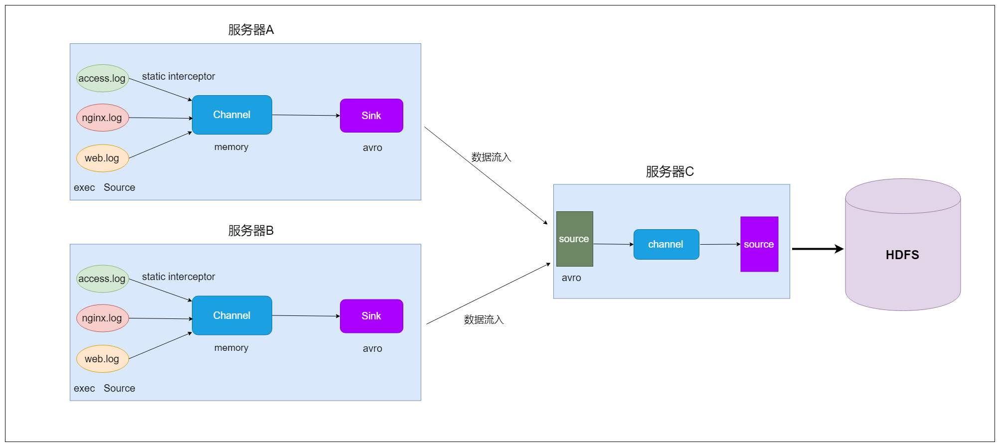

# Flume日志采集框架


## 一、课前准备

1. 安装好对应版本的hadoop集群


## 二、课堂主题

本堂课主要围绕flume的知识点进行讲解。主要包括以下几个方面

1. flume的核心概念
2. flume的应用场景
3. flume的安装部署
4. flume的企业案例


## 三、课堂目标

1. 掌握flume的应用场景
2. 掌握flume中常用的source、channel、sink使用
3. 掌握flume的企业案例


## 四、知识要点

### 1. Flume是什么 (5分钟)


~~~
	在一个完整的离线大数据处理系统中，除了hdfs+mapreduce+hive组成分析系统的核心之外，还需要数据采集、结果数据导出、任务调度等不可或缺的辅助系统，而这些辅助工具在hadoop生态体系中都有便捷的开源框架。
~~~

* Flume是Cloudera提供的一个高可用的，高可靠的，分布式的==海量日志采集、聚合和传输的系统==
* Flume支持在日志系统中定制各类数据发送方，用于收集数据；
* Flume提供对数据进行简单处理，并写到各种数据接受方（可定制）的能力。


### 2. Flume的架构（5分钟）


* Flume 的核心是把数据从数据源收集过来，再送到目的地。为了保证输送一定成功，在送到目的地之前，会先缓存数据，待数据真正到达目的地后，删除自己缓存的数据。
* Flume分布式系统中==最核心的角色是agent==，flume采集系统就是由一个个agent所连接起来形成。
* ==每一个agent相当于一个数据传递员，内部有三个组件==
  * **source**
    * 采集组件，用于跟数据源对接，以获取数据
  * **channel**
    * 传输通道组件，缓存数据，用于从source将数据传递到sink
  * **sink**
    * 下沉组件，数据发送给最终存储系统或者下一级agent中


### 3. Flume采集系统结构图（5分钟）

#### 3.1 简单结构

* 单个agent采集数据


#### 3.2 复杂结构

* 2个agent串联


* 多个agent串联


* 多个channel


### 4. Flume安装部署（5分钟）

==Flume安装很简单，解压好基本上就可以使用==

* 1、下载安装包
  - http://archive.apache.org/dist/flume/1.8.0/apache-flume-1.8.0-bin.tar.gz
  - apache-flume-1.8.0-bin.tar.gz

* 2、规划安装目录

  - /opt/bigdata

* 3、上传安装包到服务器

* 4、解压安装包到指定的规划目录

  - tar -zxvf apache-flume-1.8.0-bin.tar.gz -C /opt/bigdata

* 5、重命名解压目录

  - mv apache-flume-1.8.0-bin  flume

* 6、修改配置

  * 进入到flume安装目录下的conf文件夹中

    * 先重命名文件

      * mv flume-env.sh.template flume-env.sh

    * 修改文件，添加java环境变量

      * vim flume-env.sh

      ~~~shell
      export JAVA_HOME=/opt/bigdata/jdk
      ~~~

* 7、配置flume环境变量

  * vim  /etc/profile

  ~~~
  #配置flume的环境变量
  export FLUME_HOME=/opt/bigdata/flume
  export PATH=$PATH:$FLUME_HOME/bin
  ~~~

* 8、让flume环境变量生效

  * source /etc/profile


### 5. Flume实战（30分钟）


#### 5.1 采集目录到HDFS 

* 1、需求描述

  ~~~
  一个目录中不断有新的文件产生，需要把目录中的文件不断地进行数据收集保存到HDFS上
  ~~~

* 2、结构示意图

  

* ==3、flume配置文件开发==

  * 在flume的安装目录下创建一个文件夹myconf， 后期存放flume开发的配置文件
    * mkdir /opt/bigdata/flume/myconf
  * 在myconf目录中创建配置文件添加内容
    * vim  dir2Hdfs.conf

  ~~~
  # Name the components on this agent
  a1.sources = r1
  a1.sinks = k1
  a1.channels = c1
  
  # 配置source
  ##注意：不能往监控目中重复丢同名文件
  a1.sources.r1.type = spooldir
  a1.sources.r1.spoolDir = /opt/bigdata/flumeData
  a1.sources.r1.fileHeader = true
  a1.sources.r1.channels = c1
  
  
  #配置channel
  a1.channels.c1.type = memory
  a1.channels.c1.capacity = 1000
  a1.channels.c1.transactionCapacity = 100
  
  
  
  #配置sink
  a1.sinks.k1.type = hdfs
  a1.sinks.k1.channel = c1
  a1.sinks.k1.hdfs.path = hdfs://node1:9000/spooldir/files/%y-%m-%d/%H%M/
  a1.sinks.k1.hdfs.filePrefix = events-
  a1.sinks.k1.hdfs.round = true
  a1.sinks.k1.hdfs.roundValue = 10
  a1.sinks.k1.hdfs.roundUnit = minute
  a1.sinks.k1.hdfs.rollInterval = 60
  a1.sinks.k1.hdfs.rollSize = 50
  a1.sinks.k1.hdfs.rollCount = 10
  a1.sinks.k1.hdfs.batchSize = 100
  a1.sinks.k1.hdfs.useLocalTimeStamp = true
  #生成的文件类型，默认是Sequencefile，可用DataStream，则为普通文本
  a1.sinks.k1.hdfs.fileType = DataStream
  
  ~~~


* **4、启动agent**

~~~shell
flume-ng agent -n a1 -c /opt/bigdata/flume/myconf -f /opt/bigdata/flume/myconf/dir2Hdfs.conf -Dflume.root.logger=info,console
~~~


#### 5.2 采集文件到HDFS

* 1、需求描述

  ~~~
  监控一个文件如果有新增的内容就把数据采集到HDFS上
  ~~~

* 2、结构示意图


* ==3、flume配置文件开发==

  * vim file2Hdfs.conf

  ~~~
  # Name the components on this agent
  a1.sources = r1
  a1.sinks = k1
  a1.channels = c1
  
  #配置source
  a1.sources.r1.type = exec
  a1.sources.r1.command = tail -F /opt/bigdata/flumeData/tail.log
  a1.sources.r1.channels = c1
  
  #配置channel
  a1.channels.c1.type = file
  #检查点文件目录
  a1.channels.c1.checkpointDir=/opt/flume_checkpoint
  #缓存数据文件夹
  a1.channels.c1.dataDirs=/opt/flume_data
  
  
  #配置sink
  a1.sinks.k1.channel = c1
  a1.sinks.k1.type = hdfs
  a1.sinks.k1.hdfs.path = hdfs://node1:9000/tailFile/files/%y-%m-%d/%H%M/
  a1.sinks.k1.hdfs.filePrefix = events-
  a1.sinks.k1.hdfs.round = true
  a1.sinks.k1.hdfs.roundValue = 10
  a1.sinks.k1.hdfs.roundUnit = minute
  a1.sinks.k1.hdfs.rollInterval = 60
  a1.sinks.k1.hdfs.rollSize = 50
  a1.sinks.k1.hdfs.rollCount = 10
  a1.sinks.k1.hdfs.batchSize = 100
  a1.sinks.k1.hdfs.useLocalTimeStamp = true
  #生成的文件类型，默认是Sequencefile，可用DataStream，则为普通文本
  a1.sinks.k1.hdfs.fileType = DataStream
  ~~~


* **4、启动agent**

  ~~~
  flume-ng agent -n a1 -c /opt/bigdata/flume/myconf -f /opt/bigdata/flume/myconf/file2Hdfs.conf -Dflume.root.logger=info,console
  ~~~


#### 5.3 采集文件到控制台

* 1、需求描述

  ~~~
  监控一个文件如果有新增的内容就把数据采集之后打印控制台，通常用于测试/调试目的
  ~~~

* 2、==flume配置文件开发==

  * vim tail-memory-logger.conf

  ~~~
  # Name the components on this agent
  a1.sources = r1
  a1.sinks = k1
  a1.channels = c1
  
  #配置source
  a1.sources.r1.type = exec
  a1.sources.r1.command = tail -F /opt/bigdata/flumeData/tail.log
  a1.sources.r1.channels = c1
  
  #配置channel
  a1.channels.c1.type = memory
  a1.channels.c1.capacity = 1000
  a1.channels.c1.transactionCapacity = 100
  
  #配置sink
  a1.sinks.k1.channel = c1
  #类型是日志格式
  a1.sinks.k1.type = logger
  ~~~


* **3、启动agent**

  ~~~
  flume-ng agent -n a1 -c /opt/bigdata/flume/myconf -f /opt/bigdata/flume/myconf/tail-memory-logger.conf -Dflume.root.logger=info,console
  ~~~


#### 5.4 两个agent级联

* 1、需求描述

~~~
	第一个agent负责监控某个目录中新增的文件进行数据收集，通过网络发送到第二个agent当中去，第二个agent负责接收第一个agent发送的数据，并将数据保存到hdfs上面去。
~~~

* 2、结构示意图


* 3、在node1和node2上分别都安装flume

* 4、创建node1上的flume配置文件

  * vim dir2avro.conf

  ~~~
  # Name the components on this agent
  a1.sources = r1
  a1.sinks = k1
  a1.channels = c1
  
  # 配置source
  ##注意：不能往监控目中重复丢同名文件
  a1.sources.r1.type = spooldir
  a1.sources.r1.spoolDir = /opt/bigdata/flumeData
  a1.sources.r1.fileHeader = true
  a1.sources.r1.channels = c1
  
  
  #配置channel
  a1.channels.c1.type = memory
  a1.channels.c1.capacity = 1000
  a1.channels.c1.transactionCapacity = 100
  
  #配置sink
  a1.sinks.k1.channel = c1
  a1.sinks.k1.type = avro
  #node2
  a1.sinks.k1.hostname = 192.168.200.210
  a1.sinks.k1.port = 4141
  ~~~

* 5、创建node2上的flume配置文件

  * vim avro2Hdfs.conf

  ~~~
  # Name the components on this agent
  a1.sources = r1
  a1.sinks = k1
  a1.channels = c1
  
  #配置source
  a1.sources.r1.type = avro
  a1.sources.r1.channels = c1
  a1.sources.r1.bind = 192.168.200.210
  a1.sources.r1.port = 4141
  
  #配置channel
  a1.channels.c1.type = memory
  a1.channels.c1.capacity = 1000000
  a1.channels.c1.transactionCapacity = 10000
  
  #配置sink
  a1.sinks.k1.channel = c1
  a1.sinks.k1.type = hdfs
  a1.sinks.k1.hdfs.path = hdfs://node1:9000/avro-hdfs/files/%y-%m-%d/%H%M/
  
  a1.sinks.k1.hdfs.filePrefix = events-
  a1.sinks.k1.hdfs.round = true
  a1.sinks.k1.hdfs.roundValue = 10
  a1.sinks.k1.hdfs.roundUnit = minute
  a1.sinks.k1.hdfs.rollInterval = 60
  a1.sinks.k1.hdfs.rollSize = 50
  a1.sinks.k1.hdfs.rollCount = 10
  a1.sinks.k1.hdfs.batchSize = 100
  a1.sinks.k1.hdfs.useLocalTimeStamp = true
  #生成的文件类型，默认是Sequencefile，可用DataStream，则为普通文本
  a1.sinks.k1.hdfs.fileType = DataStream
  ~~~

* **6、启动agent**

  * 先启动node2上的flume。然后在启动node1上的flume

    * 在node2上执行

    ~~~
    flume-ng agent -n a1 -c /opt/bigdata/flume/myconf -f /opt/bigdata/flume/myconf/avro2Hdfs.conf -Dflume.root.logger=info,console
    ~~~

    * 在node1上执行

    ~~~
    flume-ng agent -n a1 -c /opt/bigdata/flume/myconf -f /opt/bigdata/flume/myconf/dir2avro.conf -Dflume.root.logger=info,console
    ~~~

    * 最后在node1上的/opt/bigdata/flumeData 目录下创建一些数据文件，最后去HDFS上查看数据。


### 6. 高可用配置案例 (20分钟)

#### 6.1 failover故障转移


* 1、节点分配

|    名称    | 服务器主机名 |     ip地址      |    角色    |
| :--------: | :----------: | :-------------: | :--------: |
|   Agent1   |    node1     | 192.168.200.200 | WebServer  |
| Collector1 |    node2     | 192.168.200.210 | AgentMstr1 |
| Collector2 |    node3     | 192.168.200.220 | AgentMstr2 |

~~~
Agent1数据分别流入到Collector1和Collector2，Flume NG本身提供了Failover机制，可以自动切换和恢复。
~~~

* 2、开发配置文件

  * node1、node2、node3分别都要安装flume

  * ==创建node1上的flume配置文件==

    * vim flume-client-failover.conf

    ~~~
    #agent name
    a1.channels = c1
    a1.sources = r1
    a1.sinks = k1 k2
    
    #set gruop
    a1.sinkgroups = g1
    
    #set sink group
    a1.sinkgroups.g1.sinks = k1 k2
    
    #set source
    a1.sources.r1.channels = c1
    a1.sources.r1.type = exec
    a1.sources.r1.command = tail -F /opt/bigdata/flumeData/tail.log
    
    #set channel
    a1.channels.c1.type = memory
    a1.channels.c1.capacity = 1000
    a1.channels.c1.transactionCapacity = 100
    
    
    # set sink1
    a1.sinks.k1.channel = c1
    a1.sinks.k1.type = avro
    a1.sinks.k1.hostname = node2
    a1.sinks.k1.port = 52020
    
    # set sink2
    a1.sinks.k2.channel = c1
    a1.sinks.k2.type = avro
    a1.sinks.k2.hostname = node3
    a1.sinks.k2.port = 52020
    
    #set failover
    a1.sinkgroups.g1.processor.type = failover
    a1.sinkgroups.g1.processor.priority.k1 = 10
    a1.sinkgroups.g1.processor.priority.k2 = 5
    a1.sinkgroups.g1.processor.maxpenalty = 10000
    ~~~

    ~~~
    说明：
    
    #这里首先要申明一个sinkgroups,然后再设置2个sink ,k1与k2,其中2个优先级是10和5。
    #而processor的maxpenalty被设置为10秒，默认是30秒.表示故障转移的最大时间
    ~~~

  * ==创建node2和node3上的flume配置文件==

    * node2和node3上配置信息相同
    * vim flume-server-failover.conf

    ~~~
    #set Agent name
    a1.sources = r1
    a1.channels = c1
    a1.sinks = k1
    
    #set channel
    a1.channels.c1.type = memory
    a1.channels.c1.capacity = 1000
    a1.channels.c1.transactionCapacity = 100
    
    # set source
    a1.sources.r1.type = avro
    a1.sources.r1.bind = 0.0.0.0
    a1.sources.r1.port = 52020
    a1.sources.r1.channels = c1
    
    #配置拦截器
    a1.sources.r1.interceptors = i1 i2
    a1.sources.r1.interceptors.i1.type = timestamp
    a1.sources.r1.interceptors.i2.type = host
    a1.sources.r1.interceptors.i2.hostHeader=hostname
    
    #set sink to hdfs
    a1.sinks.k1.channel = c1
    a1.sinks.k1.type=hdfs
    a1.sinks.k1.hdfs.path=hdfs://node1:9000/failover/logs/%{hostname}
    a1.sinks.k1.hdfs.filePrefix=%Y-%m-%d
    a1.sinks.k1.hdfs.round = true
    a1.sinks.k1.hdfs.roundValue = 10
    a1.sinks.k1.hdfs.roundUnit = minute
    a1.sinks.k1.hdfs.rollInterval = 60
    a1.sinks.k1.hdfs.rollSize = 50
    a1.sinks.k1.hdfs.rollCount = 10
    a1.sinks.k1.hdfs.batchSize = 100
    a1.sinks.k1.hdfs.fileType = DataStream
    ~~~


* 3、启动flume配置

  * 先分别在node2和node3上启动

  ~~~
  flume-ng agent -n a1 -c /opt/bigdata/flume/myconf -f /opt/bigdata/flume/myconf/flume-server-failover.conf -Dflume.root.logger=info,console
  ~~~


  * 然后在node1上启动

  ~~~
  flume-ng agent -n a1 -c /opt/bigdata/flume/myconf -f /opt/bigdata/flume/myconf/flume-client-failover.conf -Dflume.root.logger=info,console
  ~~~


  * 最后在hdfs目录上观察数据

  ~~~
  hdfs://node1:9000/failover/logs
  ~~~


#### 6.2 load balance负载均衡

* 实现多个flume采集数据的时候避免单个flume的负载比较高，实现多个flume采集器负载均衡。

* 1、节点分配

  * 与failover故障转移的节点分配

* 2、开发配置文件

  * ==创建node1上的flume配置文件==

    * vim  flume-client-loadbalance.conf

    ~~~
    #agent name
    a1.channels = c1
    a1.sources = r1
    a1.sinks = k1 k2
    
    #set gruop
    a1.sinkgroups = g1
    
    #set sink group
    a1.sinkgroups.g1.sinks = k1 k2
    
    #set source
    a1.sources.r1.channels = c1
    a1.sources.r1.type = exec
    a1.sources.r1.command = tail -F /opt/bigdata/flumeData/tail.log
    
    #set channel
    a1.channels.c1.type = memory
    a1.channels.c1.capacity = 1000
    a1.channels.c1.transactionCapacity = 100
    
    
    # set sink1
    a1.sinks.k1.channel = c1
    a1.sinks.k1.type = avro
    a1.sinks.k1.hostname = node2
    a1.sinks.k1.port = 52020
    
    # set sink2
    a1.sinks.k2.channel = c1
    a1.sinks.k2.type = avro
    a1.sinks.k2.hostname = node3
    a1.sinks.k2.port = 52020
    
    #set load-balance
    a1.sinkgroups.g1.processor.type =load_balance
    # 默认是round_robin，还可以选择random
    a1.sinkgroups.g1.processor.selector = round_robin
    #如果backoff被开启，则sink processor会屏蔽故障的sink
    a1.sinkgroups.g1.processor.backoff = true
    ~~~

  * ==创建node2和node3上的flume配置文件==

    * vim  flume-server-loadbalance.conf

    ~~~
    #set Agent name
    a1.sources = r1
    a1.channels = c1
    a1.sinks = k1
    
    #set channel
    a1.channels.c1.type = memory
    a1.channels.c1.capacity = 1000
    a1.channels.c1.transactionCapacity = 100
    
    # set source
    a1.sources.r1.type = avro
    a1.sources.r1.bind = 0.0.0.0
    a1.sources.r1.port = 52020
    a1.sources.r1.channels = c1
    
    #配置拦截器
    a1.sources.r1.interceptors = i1 i2
    a1.sources.r1.interceptors.i1.type = timestamp
    a1.sources.r1.interceptors.i2.type = host
    a1.sources.r1.interceptors.i2.hostHeader=hostname
    a1.sources.r1.interceptors.i2.useIP=false
    
    #set sink to hdfs
    a1.sinks.k1.channel = c1
    a1.sinks.k1.type=hdfs
    a1.sinks.k1.hdfs.path=hdfs://node1:9000/loadbalance/logs/%{hostname}
    a1.sinks.k1.hdfs.filePrefix=%Y-%m-%d
    a1.sinks.k1.hdfs.round = true
    a1.sinks.k1.hdfs.roundValue = 10
    a1.sinks.k1.hdfs.roundUnit = minute
    a1.sinks.k1.hdfs.rollInterval = 60
    a1.sinks.k1.hdfs.rollSize = 50
    a1.sinks.k1.hdfs.rollCount = 10
    a1.sinks.k1.hdfs.batchSize = 100
    a1.sinks.k1.hdfs.fileType = DataStream
    ~~~

* 3、启动flume配置

  - 先分别在node2和node3上启动

  ```
  flume-ng agent -n a1 -c /opt/bigdata/flume/myconf -f /opt/bigdata/flume/myconf/flume-server-loadbalance.conf -Dflume.root.logger=info,console
  ```


  - 然后在node1上启动

  ```
  flume-ng agent -n a1 -c /opt/bigdata/flume/myconf -f /opt/bigdata/flume/myconf/flume-client-loadbalance.conf -Dflume.root.logger=info,console
  ```


  - 最后在hdfs上目录观察数据

  ~~~
  hdfs://node1:9000/loadbalance/logs
  ~~~


### 7. flume企业案例（20分钟）

#### 7.1 flume案例之静态拦截器使用

* 1、案例场景

~~~
A、B两台日志服务机器实时生产日志主要类型为access.log、nginx.log、web.log 
现在需要把A、B 机器中的access.log、nginx.log、web.log 采集汇总到C机器上然后统一收集到hdfs中。
但是在hdfs中要求的目录为：
/source/logs/access/20180101/**
/source/logs/nginx/20180101/**
/source/logs/web/20180101/**
~~~

* 2、场景分析


* 3、数据流程处理分析



* 4、开发配置文件

  * ==在node1与node2服务器开发flume的配置文件==

    * vim exec_source_avro_sink.conf

    ~~~
    # Name the components on this agent
    a1.sources = r1 r2 r3
    a1.sinks = k1
    a1.channels = c1
    
    # Describe/configure the source
    a1.sources.r1.type = exec
    a1.sources.r1.command = tail -F /home/hadoop/taillogs/access.log
    a1.sources.r1.interceptors = i1
    a1.sources.r1.interceptors.i1.type = static
    ## static拦截器的功能就是往采集到的数据的header中插入自己定义的key-value对
    a1.sources.r1.interceptors.i1.key = type
    a1.sources.r1.interceptors.i1.value = access
    
    a1.sources.r2.type = exec
    a1.sources.r2.command = tail -F /home/hadoop/taillogs/nginx.log
    a1.sources.r2.interceptors = i2
    a1.sources.r2.interceptors.i2.type = static
    a1.sources.r2.interceptors.i2.key = type
    a1.sources.r2.interceptors.i2.value = nginx
    
    a1.sources.r3.type = exec
    a1.sources.r3.command = tail -F /home/hadoop/taillogs/web.log
    a1.sources.r3.interceptors = i3
    a1.sources.r3.interceptors.i3.type = static
    a1.sources.r3.interceptors.i3.key = type
    a1.sources.r3.interceptors.i3.value = web
    
    # Use a channel which buffers events in memory
    a1.channels.c1.type = memory
    a1.channels.c1.capacity = 20000
    a1.channels.c1.transactionCapacity = 10000
    
    # Describe the sink
    a1.sinks.k1.type = avro
    a1.sinks.k1.hostname = node3
    a1.sinks.k1.port = 41414
    a1.sinks.k1.channel = c1
    
    # Bind the source and sink to the channel
    a1.sources.r1.channels = c1
    a1.sources.r2.channels = c1
    a1.sources.r3.channels = c1
    
    ~~~

  * ==在node3服务器上开发flume配置文件==

    * vim avro_source_hdfs_sink.conf

    ~~~
    a1.sources = r1
    a1.sinks = k1
    a1.channels = c1
    #定义source
    a1.sources.r1.type = avro
    a1.sources.r1.bind = node3
    a1.sources.r1.port =41414
    
    #定义channels
    a1.channels.c1.type = memory
    a1.channels.c1.capacity = 20000
    a1.channels.c1.transactionCapacity = 10000
    
    #定义sink
    a1.sinks.k1.type = hdfs
    a1.sinks.k1.hdfs.path=hdfs://node1:9000/source/logs/%{type}/%Y%m%d
    a1.sinks.k1.hdfs.filePrefix =events
    a1.sinks.k1.hdfs.fileType = DataStream
    a1.sinks.k1.hdfs.writeFormat = Text
    #时间类型
    a1.sinks.k1.hdfs.useLocalTimeStamp = true
    #生成的文件不按条数生成
    a1.sinks.k1.hdfs.rollCount = 0
    #生成的文件按时间生成
    a1.sinks.k1.hdfs.rollInterval = 30
    #生成的文件按大小生成
    a1.sinks.k1.hdfs.rollSize  = 10485760
    #批量写入hdfs的个数
    a1.sinks.k1.hdfs.batchSize = 1000
    #flume操作hdfs的线程数（包括新建，写入等）
    a1.sinks.k1.hdfs.threadsPoolSize=10
    #操作hdfs超时时间
    a1.sinks.k1.hdfs.callTimeout=30000
    
    #组装source、channel、sink
    a1.sources.r1.channels = c1
    a1.sinks.k1.channel = c1
    ~~~

* 5、启动flume配置

  * 先在node3上启动flume

  ```
  flume-ng agent -n a1 -c /opt/bigdata/flume/myconf -f /opt/bigdata/flume/myconf/avro_source_hdfs_sink.conf -Dflume.root.logger=info,console
  ```
  * 然后分别在node1和node2上启动flume

  ~~~
  flume-ng agent -n a1 -c /opt/bigdata/flume/myconf -f /opt/bigdata/flume/myconf/exec_source_avro_sink.conf -Dflume.root.logger=info,console
  
  ~~~

  * 在node1和node2上准备数据文件

    ~~~
    /home/hadoop/taillogs/access.log
    /home/hadoop/taillogs/nginx.log
    /home/hadoop/taillogs/web.log
    
    创建以上文件，内容是什么不重要
    ~~~

  * 最后在hdfs上对应的目录观察

  ~~~
  hdfs://node1:9000/source/logs
  
  13901007610,male,30,sing,beijing
  18600000035,male,40,dance,shanghai
  13366666659,male,20,Swimming,wuhan
  13801179888,female,18,dance,tianjin
  18511111114,male,35,sing,beijing
  13718428888,female,40,Foodie,shanghai
  13901057088,male,50,Basketball,taiwan
  13671057777,male,60,Bodybuilding,xianggang
  ~~~


#### 7.2 flume案例之自定义拦截器

* 1、案例场景

~~~
在数据采集之后，通过flume的拦截器，实现不需要的数据过滤掉，并将指定的第一个字段进行加密，加密之后再往hdfs上面保存
~~~

* 2、数据文件 user.txt

~~~
13901007610,male,30,sing,beijing
18600000035,male,40,dance,shanghai
13366666659,male,20,Swimming,wuhan
13801179888,female,18,dance,tianjin
18511111114,male,35,sing,beijing
13718428888,female,40,Foodie,shanghai
13901057088,male,50,Basketball,taiwan
13671057777,male,60,Bodybuilding,xianggang
~~~


* 3、代码开发

~~~java
package com.kaikeba.interceptor;

import com.google.common.base.Charsets;
import org.apache.flume.Context;
import org.apache.flume.Event;
import org.apache.flume.interceptor.Interceptor;

import java.math.BigInteger;
import java.security.MessageDigest;
import java.security.NoSuchAlgorithmException;
import java.util.ArrayList;
import java.util.List;

public class MyInterceptor implements Interceptor {
    /** encrypted_field_index. 指定需要加密的字段下标 */
    private final String encrypted_field_index;


    /** The out_index. 指定不需要对应列的下标*/
    private final String out_index;

    /**
     * 提供构建方法，后期可以接受配置文件中的参数
     * @param encrypted_field_index
     * @param out_index
     */
    public MyInterceptor( String encrypted_field_index, String out_index) {
        this.encrypted_field_index=encrypted_field_index.trim();
        this.out_index=out_index.trim();

    }


    /*
         *
         * 单个event拦截逻辑
         */
    public Event intercept(Event event) {
        if (event == null) {
            return null;
        }
        try {
            String line = new String(event.getBody(), Charsets.UTF_8);
            String[] fields = line.split(",");

            String newLine = "";
            for (int i = 0; i < fields.length; i++) {
                //字符串数字转换成int
                int encryptedField = Integer.parseInt(encrypted_field_index);
                int outIndex = Integer.parseInt(out_index);

                if (i == encryptedField) {
                     newLine+=md5(fields[i])+",";
                }else if(i !=outIndex) {
                    newLine+=fields[i]+",";
                }
            }
            newLine=newLine.substring(0,newLine.length()-1);

              event.setBody(newLine.getBytes(Charsets.UTF_8));
            return event;
        } catch (Exception e) {
            return event;
        }

    }

    /*
     *
     * 批量event拦截逻辑
     */
    public List<Event> intercept(List<Event> events) {
        List<Event> out = new ArrayList<Event>();
        for (Event event : events) {
            Event outEvent = intercept(event);
            if (outEvent != null) {
                out.add(outEvent);
            }
        }
        return out;
    }


    public void close() {

    }


    public void initialize() {

    }

    //写一个md5加密的方法
    public static String md5(String plainText) {
        //定义一个字节数组
        byte[] secretBytes = null;
        try {
            // 生成一个MD5加密计算摘要
            MessageDigest md = MessageDigest.getInstance("MD5");
            //对字符串进行加密
            md.update(plainText.getBytes());
            //获得加密后的数据
            secretBytes = md.digest();
        } catch (NoSuchAlgorithmException e) {
            throw new RuntimeException("没有md5这个算法！");
        }
        //将加密后的数据转换为16进制数字
        String md5code = new BigInteger(1, secretBytes).toString(16);// 16进制数字
        // 如果生成数字未满32位，需要前面补0
        for (int i = 0; i < 32 - md5code.length(); i++) {
            md5code = "0" + md5code;
        }
        return md5code;
    }


    /**
     * 相当于自定义Interceptor的工厂类
     * 在flume采集配置文件中通过制定该Builder来创建Interceptor对象
     * 可以在Builder中获取、解析flume采集配置文件中的拦截器Interceptor的自定义参数：
     * 指定需要加密的字段下标 指定不需要对应列的下标等
     * @author
     *
     */
    public static class MyBuilder implements Interceptor.Builder {

        /**
         * encrypted_field_index. 指定需要加密的字段下标
         */
        private  String encrypted_field_index;


        /**
         * The out_index. 指定不需要对应列的下标
         */
        private  String out_index;

        public void configure(Context context) {
            this.encrypted_field_index = context.getString("encrypted_field_index", "");
            this.out_index = context.getString("out_index", "");
        }

        /*
         * @see org.apache.flume.interceptor.Interceptor.Builder#build()
         */
        public MyInterceptor build() {
            return new MyInterceptor(encrypted_field_index, out_index);
        }

    }

}
~~~

* 配置文件 flume-interceptor-hdfs.conf

~~~
# Name the components on this agent
a1.sources = r1
a1.sinks = k1
a1.channels = c1

#配置source
a1.sources.r1.type = exec
a1.sources.r1.command = tail -F /opt/bigdata/data/user.txt
a1.sources.r1.channels = c1
a1.sources.r1.interceptors =i1
a1.sources.r1.interceptors.i1.type =com.kaikeba.interceptor.MyInterceptor$MyBuilder
a1.sources.r1.interceptors.i1.encrypted_field_index=0
a1.sources.r1.interceptors.i1.out_index=3

#配置channel
a1.channels.c1.type = memory
a1.channels.c1.capacity = 1000
a1.channels.c1.transactionCapacity = 100


#配置sink
a1.sinks.k1.type = hdfs
a1.sinks.k1.channel = c1
a1.sinks.k1.hdfs.path = hdfs://node1:9000/interceptor/files/%y-%m-%d/%H%M/
a1.sinks.k1.hdfs.filePrefix = events-
a1.sinks.k1.hdfs.round = true
a1.sinks.k1.hdfs.roundValue = 10
a1.sinks.k1.hdfs.roundUnit = minute
a1.sinks.k1.hdfs.rollInterval = 5
a1.sinks.k1.hdfs.rollSize = 50
a1.sinks.k1.hdfs.rollCount = 10
a1.sinks.k1.hdfs.batchSize = 100
a1.sinks.k1.hdfs.useLocalTimeStamp = true
#生成的文件类型，默认是Sequencefile，可用DataStream，则为普通文本
a1.sinks.k1.hdfs.fileType = DataStream
~~~

~~~~
flume-ng agent -n a1 -c /opt/bigdata/flume/myconf -f /opt/bigdata/flume/myconf/flume-interceptor-hdfs.conf -Dflume.root.logger=info,console
~~~~


### 8. flume自定义Source（15分钟）

#### 8.1 场景描述

~~~
	官方提供的source类型已经很多，但是有时候并不能满足实际开发当中的需求，此时我们就需要根据实际需求自定义某些source。如：实时监控MySQL，从MySQL中获取数据传输到HDFS或者其他存储框架，所以此时需要我们自己实现MySQLSource。

官方也提供了自定义source的接口：
官网说明：https://flume.apache.org/FlumeDeveloperGuide.html#source
~~~


#### 8.2 自定义MysqlSource步骤

* 1、根据官方说明自定义mysqlsource需要继承AbstractSource类并实现Configurable和PollableSource接口。


* 2、实现对应的方法

  * configure(Context context)
    * 初始化context
  * process()
    * 从mysql表中获取数据，然后把数据封装成event对象写入到channel，该方法被一直调用
  * stop()
    * 关闭相关资源


* 3、开发流程

  * 3.1 创建mysql数据库以及mysql数据库表

  ~~~sql
  --创建一个数据库
  CREATE DATABASE IF NOT EXISTS mysqlsource DEFAULT CHARACTER SET utf8 ;
  
  --创建一个表，用户保存拉取目标表位置的信息
  CREATE TABLE mysqlsource.flume_meta (
    source_tab varchar(255) NOT NULL,
    currentIndex varchar(255) NOT NULL,
    PRIMARY KEY (source_tab)
  ) ENGINE=InnoDB DEFAULT CHARSET=utf8;
  
  --插入数据
  insert  into mysqlsource.flume_meta(source_tab,currentIndex) values ('student','4');
  
  
  --创建要拉取数据的表
  CREATE TABLE mysqlsource.student(
    id int(11) NOT NULL AUTO_INCREMENT,
    name varchar(255) NOT NULL,
    PRIMARY KEY (id)
  ) ENGINE=InnoDB AUTO_INCREMENT=5 DEFAULT CHARSET=utf8;
  
  --向student表中添加测试数据
  insert  into mysqlsource.student(id,name) values (1,'zhangsan'),(2,'lisi'),(3,'wangwu'),(4,'zhaoliu');
  ~~~

  * 3.2 代码开发实现

    *  构建maven工程，添加依赖
    *  

    ~~~xml
        <dependencies>
            <dependency>
                <groupId>org.apache.flume</groupId>
                <artifactId>flume-ng-core</artifactId>
                <version>1.8.0</version>
            </dependency>
    
            <dependency>
                <groupId>mysql</groupId>
                <artifactId>mysql-connector-java</artifactId>
                <version>5.1.38</version>
            </dependency>
            <dependency>
                <groupId>org.apache.commons</groupId>
                <artifactId>commons-lang3</artifactId>
                <version>3.6</version>
            </dependency>
        </dependencies>
    
    
        <build>
            <plugins>
                <plugin>
                    <groupId>org.apache.maven.plugins</groupId>
                    <artifactId>maven-compiler-plugin</artifactId>
                    <version>3.0</version>
                    <configuration>
                        <source>1.8</source>
                        <target>1.8</target>
                        <encoding>UTF-8</encoding>
                        <!--    <verbal>true</verbal>-->
                    </configuration>
                </plugin>
                <plugin>
                    <groupId>org.apache.maven.plugins</groupId>
                    <artifactId>maven-shade-plugin</artifactId>
                    <version>3.1.1</version>
                    <executions>
                        <execution>
                            <phase>package</phase>
                            <goals>
                                <goal>shade</goal>
                            </goals>
                            <configuration>
                                <filters>
                                    <filter>
                                        <artifact>*:*</artifact>
                                        <excludes>
                                            <exclude>META-INF/*.SF</exclude>
                                            <exclude>META-INF/*.DSA</exclude>
                                            <exclude>META-INF/*.RSA</exclude>
                                        </excludes>
                                    </filter>
                                </filters>
                                <transformers>
                                    <transformer implementation="org.apache.maven.plugins.shade.resource.ManifestResourceTransformer">
                                        <mainClass></mainClass>
                                    </transformer>
                                </transformers>
                            </configuration>
                        </execution>
                    </executions>
                </plugin>
            </plugins>
        </build>
    ~~~

    * 在resources资源文件夹下添加jdbc.properties

      * ==jdbc.properties==

      ~~~~
      dbDriver=com.mysql.jdbc.Driver
      dbUrl=jdbc:mysql://node1:3306/mysqlsource?useUnicode=true&characterEncoding=utf-8
      dbUser=root
      dbPassword=123456
      ~~~~

    * ==定义QueryMysql工具类==

      ~~~~java
      package com.kaikeba.source;
      
      import org.apache.flume.Context;
      import org.apache.flume.conf.ConfigurationException;
      import org.slf4j.Logger;
      import org.slf4j.LoggerFactory;
      
      import java.sql.*;
      import java.text.ParseException;
      import java.util.ArrayList;
      import java.util.List;
      import java.util.Properties;
      
      public class QueryMysql {
          private static final Logger LOG = LoggerFactory.getLogger(QueryMysql.class);
      
          private int runQueryDelay,   //两次查询的时间间隔
                  startFrom,            //开始id
                  currentIndex,	      //当前id
                  recordSixe = 0,        //每次查询返回结果的条数
                  maxRow;                //每次查询的最大条数
      
      private String table,          //要操作的表
                  columnsToSelect,       //用户传入的查询的列
                  customQuery,          //用户传入的查询语句
                  query,                 //构建的查询语句
                  defaultCharsetResultSet;//编码集
      
          //上下文，用来获取配置文件
          private Context context;
      
          //为定义的变量赋值（默认值），可在flume任务的配置文件中修改
          private static final int DEFAULT_QUERY_DELAY = 10000;
          private static final int DEFAULT_START_VALUE = 0;
          private static final int DEFAULT_MAX_ROWS = 2000;
          private static final String DEFAULT_COLUMNS_SELECT = "*";
          private static final String DEFAULT_CHARSET_RESULTSET = "UTF-8";
      
          private static Connection conn = null;
          private static PreparedStatement ps = null;
          private static String connectionURL, connectionUserName, connectionPassword;
      
          //加载静态资源
          static {
              Properties p = new Properties();
              try {
                  p.load(QueryMysql.class.getClassLoader().getResourceAsStream("jdbc.properties"));
                  connectionURL = p.getProperty("dbUrl");
                  connectionUserName = p.getProperty("dbUser");
                  connectionPassword = p.getProperty("dbPassword");
                  Class.forName(p.getProperty("dbDriver"));
              } catch (Exception e) {
                  LOG.error(e.toString());
              }
          }
      
          //获取JDBC连接
          private static Connection InitConnection(String url, String user, String pw) {
              try {
                  Connection conn = DriverManager.getConnection(url, user, pw);
                  if (conn == null)
                      throw new SQLException();
                  return conn;
              } catch (SQLException e) {
                  e.printStackTrace();
              }
              return null;
          }
      
          //构造方法
          QueryMysql(Context context) throws ParseException {
              //初始化上下文
              this.context = context;
      
              //有默认值参数：获取flume任务配置文件中的参数，读不到的采用默认值
              this.columnsToSelect = context.getString("columns.to.select", DEFAULT_COLUMNS_SELECT);
              this.runQueryDelay = context.getInteger("run.query.delay", DEFAULT_QUERY_DELAY);
              this.startFrom = context.getInteger("start.from", DEFAULT_START_VALUE);
              this.defaultCharsetResultSet = context.getString("default.charset.resultset", DEFAULT_CHARSET_RESULTSET);
      
              //无默认值参数：获取flume任务配置文件中的参数
              this.table = context.getString("table");
              this.customQuery = context.getString("custom.query");
      
              connectionURL = context.getString("connection.url");
              connectionUserName = context.getString("connection.user");
              connectionPassword = context.getString("connection.password");
              conn = InitConnection(connectionURL, connectionUserName, connectionPassword);
      
              //校验相应的配置信息，如果没有默认值的参数也没赋值，抛出异常
              checkMandatoryProperties();
              //获取当前的id
              currentIndex = getStatusDBIndex(startFrom);
              //构建查询语句
              query = buildQuery();
          }
      
          //校验相应的配置信息（表，查询语句以及数据库连接的参数）
          private void checkMandatoryProperties() {
              if (table == null) {
                  throw new ConfigurationException("property table not set");
              }
              if (connectionURL == null) {
                  throw new ConfigurationException("connection.url property not set");
              }
              if (connectionUserName == null) {
                  throw new ConfigurationException("connection.user property not set");
              }
              if (connectionPassword == null) {
                  throw new ConfigurationException("connection.password property not set");
              }
          }
      
          //构建sql语句
          private String buildQuery() {
              String sql = "";
              //获取当前id
              currentIndex = getStatusDBIndex(startFrom);
              LOG.info(currentIndex + "");
              if (customQuery == null) {
                  sql = "SELECT " + columnsToSelect + " FROM " + table;
              } else {
                  sql = customQuery;
              }
              StringBuilder execSql = new StringBuilder(sql);
              //以id作为offset
              if (!sql.contains("where")) {
                  execSql.append(" where ");
                  execSql.append("id").append(">").append(currentIndex);
                  return execSql.toString();
              } else {
                  int length = execSql.toString().length();
                  return execSql.toString().substring(0, length - String.valueOf(currentIndex).length()) + currentIndex;
              }
          }
      
          //执行查询
          List<List<Object>> executeQuery() {
              try {
                  //每次执行查询时都要重新生成sql，因为id不同
                  customQuery = buildQuery();
                  //存放结果的集合
                  List<List<Object>> results = new ArrayList<>();
                  if (ps == null) {
                      //初始化PrepareStatement对象
                      ps = conn.prepareStatement(customQuery);
                  }
                  ResultSet result = ps.executeQuery(customQuery);
                  while (result.next()) {
                      //存放一条数据的集合（多个列）
                      List<Object> row = new ArrayList<>();
                      //将返回结果放入集合
                      for (int i = 1; i <= result.getMetaData().getColumnCount(); i++) {
                          row.add(result.getObject(i));
                      }
                      results.add(row);
                  }
                  LOG.info("execSql:" + customQuery + "\nresultSize:" + results.size());
                  return results;
              } catch (SQLException e) {
                  LOG.error(e.toString());
                  // 重新连接
                  conn = InitConnection(connectionURL, connectionUserName, connectionPassword);
              }
              return null;
          }
      
          //将结果集转化为字符串，每一条数据是一个list集合，将每一个小的list集合转化为字符串
          List<String> getAllRows(List<List<Object>> queryResult) {
              List<String> allRows = new ArrayList<>();
              if (queryResult == null || queryResult.isEmpty())
                  return allRows;
              StringBuilder row = new StringBuilder();
              for (List<Object> rawRow : queryResult) {
                  Object value = null;
                  for (Object aRawRow : rawRow) {
                      value = aRawRow;
                      if (value == null) {
                          row.append(",");
                      } else {
                          row.append(aRawRow.toString()).append(",");
                      }
                  }
                  allRows.add(row.toString());
                  row = new StringBuilder();
              }
              return allRows;
          }
      
          //更新offset元数据状态，每次返回结果集后调用。必须记录每次查询的offset值，为程序中断续跑数据时使用，以id为offset
          void updateOffset2DB(int size) {
              //以source_tab做为KEY，如果不存在则插入，存在则更新（每个源表对应一条记录）
              String sql = "insert into flume_meta(source_tab,currentIndex) VALUES('"
                      + this.table
                      + "','" + (recordSixe += size)
                      + "') on DUPLICATE key update source_tab=values(source_tab),currentIndex=values(currentIndex)";
              LOG.info("updateStatus Sql:" + sql);
              execSql(sql);
          }
      
          //执行sql语句
          private void execSql(String sql) {
              try {
                  ps = conn.prepareStatement(sql);
                  LOG.info("exec::" + sql);
                  ps.execute();
              } catch (SQLException e) {
                  e.printStackTrace();
              }
          }
      
          //获取当前id的offset
          private Integer getStatusDBIndex(int startFrom) {
              //从flume_meta表中查询出当前的id是多少
              String dbIndex = queryOne("select currentIndex from flume_meta where source_tab='" + table + "'");
              if (dbIndex != null) {
                  return Integer.parseInt(dbIndex);
              }
              //如果没有数据，则说明是第一次查询或者数据表中还没有存入数据，返回最初传入的值
              return startFrom;
          }
      
          //查询一条数据的执行语句(当前id)
          private String queryOne(String sql) {
              ResultSet result = null;
              try {
                  ps = conn.prepareStatement(sql);
                  result = ps.executeQuery();
                  while (result.next()) {
                      return result.getString(1);
                  }
              } catch (SQLException e) {
                  e.printStackTrace();
              }
              return null;
          }
      
          //关闭相关资源
          void close() {
              try {
                  ps.close();
                  conn.close();
              } catch (SQLException e) {
                  e.printStackTrace();
              }
          }
      
          int getCurrentIndex() {
              return currentIndex;
          }
      
          void setCurrentIndex(int newValue) {
              currentIndex = newValue;
          }
      
          int getRunQueryDelay() {
              return runQueryDelay;
          }
      
          String getQuery() {
              return query;
          }
      
          String getConnectionURL() {
              return connectionURL;
          }
      
          private boolean isCustomQuerySet() {
              return (customQuery != null);
          }
      
          Context getContext() {
              return context;
          }
      
          public String getConnectionUserName() {
              return connectionUserName;
          }
      
          public String getConnectionPassword() {
              return connectionPassword;
          }
      
          String getDefaultCharsetResultSet() {
              return defaultCharsetResultSet;
          }
      }
      ~~~~

    * ==定义QueryMysql工具类==

      ~~~java
      package com.kaikeba.source;
      import org.apache.flume.Context;
      import org.apache.flume.Event;
      import org.apache.flume.EventDeliveryException;
      import org.apache.flume.PollableSource;
      import org.apache.flume.conf.Configurable;
      import org.apache.flume.event.SimpleEvent;
      import org.apache.flume.source.AbstractSource;
      import org.slf4j.Logger;
      import org.slf4j.LoggerFactory;
      
      import java.text.ParseException;
      import java.util.ArrayList;
      import java.util.HashMap;
      import java.util.List;
      
      public class MySqlSource extends AbstractSource implements Configurable, PollableSource {
      
          //打印日志
          private static final Logger LOG = LoggerFactory.getLogger(MySqlSource.class);
          //定义sqlHelper
          private QueryMysql sqlSourceHelper;
              @Override
          public long getBackOffSleepIncrement() {
              return 0;
          }
      
          @Override
          public long getMaxBackOffSleepInterval() {
              return 0;
          }
      
          @Override
          public void configure(Context context) {
              //初始化
              try {
                  sqlSourceHelper = new QueryMysql(context);
              } catch (ParseException e) {
                  e.printStackTrace();
              }
          }
      
          /**
           * 接受mysql表中的数据
           * @return
           * @throws EventDeliveryException
           */
          @Override
          public PollableSource.Status process() throws EventDeliveryException {
              try {
                  //查询数据表
                  List<List<Object>> result = sqlSourceHelper.executeQuery();
                  //存放event的集合
                  List<Event> events = new ArrayList<>();
                  //存放event头集合
                  HashMap<String, String> header = new HashMap<>();
                  //如果有返回数据，则将数据封装为event
                  if (!result.isEmpty()) {
                      List<String> allRows = sqlSourceHelper.getAllRows(result);
                      Event event = null;
                      for (String row : allRows) {
                          event = new SimpleEvent();
                          event.setBody(row.getBytes());
                          event.setHeaders(header);
                          events.add(event);
                      }
                      //将event写入channel
                      this.getChannelProcessor().processEventBatch(events);
                      //更新数据表中的offset信息
                      sqlSourceHelper.updateOffset2DB(result.size());
                  }
                  //等待时长
                  Thread.sleep(sqlSourceHelper.getRunQueryDelay());
                  return Status.READY;
              } catch (InterruptedException e) {
                  LOG.error("Error procesing row", e);
                  return Status.BACKOFF;
              }
          }
      
          @Override
          public synchronized void stop() {
              LOG.info("Stopping sql source {} ...", getName());
              try {
                  //关闭资源
                  sqlSourceHelper.close();
              } finally {
                  super.stop();
              }
          }
      }
      ~~~


* 4、测试

  * 4.1 ==程序打成jar包，上传jar包到flume的lib目录下==

  * 4.2 ==配置文件准备==

    * vim mysqlsource.conf

    ~~~
    # Name the components on this agent
    a1.sources = r1
    a1.sinks = k1
    a1.channels = c1
    
    # Describe/configure the source
    a1.sources.r1.type = com.kaikeba.source.MySqlSource
    a1.sources.r1.connection.url = jdbc:mysql://node1:3306/mysqlsource
    a1.sources.r1.connection.user = root
    a1.sources.r1.connection.password = 123456
    a1.sources.r1.table = student
    a1.sources.r1.columns.to.select = *
    a1.sources.r1.start.from=0
    a1.sources.r1.run.query.delay=3000
    
    # Describe the channel
    a1.channels.c1.type = memory
    a1.channels.c1.capacity = 1000
    a1.channels.c1.transactionCapacity = 100
    
    # Describe the sink
    a1.sinks.k1.type = logger
    
    
    # Bind the source and sink to the channel
    a1.sources.r1.channels = c1
    a1.sinks.k1.channel = c1
    ~~~

  * 4.3 ==启动flume配置==

  ~~~
  flume-ng agent -n a1 -c /opt/bigdata/flume/myconf -f /opt/bigdata/flume/myconf/mysqlsource.conf -Dflume.root.logger=info,console
  ~~~

  * 4.4 最后向表添加数据，观察控制台信息


### 9. flume自定义Sink（15分钟）

#### 9.1 场景描述

```
	官方提供的sink类型已经很多，但是有时候并不能满足实际开发当中的需求，此时我们就需要根据实际需求自定义某些sink。如：需要把接受到的数据按照规则进行过滤之后写入到某张mysql表中，所以此时需要我们自己实现MySQLSink。

官方也提供了自定义sink的接口：
官网说明：https://flume.apache.org/FlumeDeveloperGuide.html#sink
```


#### 9.2 自定义MysqlSink步骤

- 1、根据官方说明自定义MysqlSink需要继承AbstractSink类并实现Configurable

- 2、实现对应的方法

  - configure(Context context)

    - 初始化context

  - start()

    - 启动准备操作

  - process()

    - 从channel获取数据，然后解析之后，保存在mysql表中

  - stop()

    - 关闭相关资源


- 3、开发流程

  - 3.1 ==创建mysql数据库以及mysql数据库表==

  ~~~SQL
  --创建一个数据库
  CREATE DATABASE IF NOT EXISTS mysqlsource DEFAULT CHARACTER SET utf8 ;
  
  --创建一个表，用户保存拉取目标表位置的信息
  CREATE TABLE mysqlsource.flume2mysql (
    id int(11) NOT NULL AUTO_INCREMENT,
    createTime varchar(64) NOT NULL,
    content varchar(255) NOT NULL,
    PRIMARY KEY (id)
  ) ENGINE=InnoDB DEFAULT CHARSET=utf8;
  ~~~


  - 3.2  代码开发实现

      - ==定义MysqlSink类==


```java
package com.kaikeba.sink;

import org.apache.flume.conf.Configurable;
import org.apache.flume.*;
import org.apache.flume.sink.AbstractSink;

import java.sql.Connection;
import java.sql.DriverManager;
import java.sql.PreparedStatement;
import java.sql.SQLException;
import java.text.SimpleDateFormat;
import java.util.Date;

/**
 * 自定义MysqlSink
 */
public class MysqlSink extends AbstractSink implements Configurable {
    private String mysqlurl = "";
    private String username = "";
    private String password = "";
    private String tableName = "";

    Connection con = null;

    @Override
    public Status process(){
        Status status = null;
        // Start transaction
        Channel ch = getChannel();
        Transaction txn = ch.getTransaction();
        txn.begin();
        try
        {
            Event event = ch.take();

            if (event != null)
            {
                    //获取body中的数据
                    String body = new String(event.getBody(), "UTF-8");

                    //如果日志中有以下关键字的不需要保存，过滤掉
                if(body.contains("delete") || body.contains("drop") || body.contains("alert")){
                    status = Status.BACKOFF;
                }else {

                    //存入Mysql
                    SimpleDateFormat df = new SimpleDateFormat("yyyy-MM-dd HH:mm:ss");
                    String createtime = df.format(new Date());

                    PreparedStatement stmt = con.prepareStatement("insert into " + tableName + " (createtime, content) values (?, ?)");
                    stmt.setString(1, createtime);
                    stmt.setString(2, body);
                    stmt.execute();
                    stmt.close();
                    status = Status.READY;
                }
           }else {
                    status = Status.BACKOFF;
                }

            txn.commit();
        } catch (Throwable t){
            txn.rollback();
            t.getCause().printStackTrace();
            status = Status.BACKOFF;
        } finally{
            txn.close();
        }

        return status;
    }
    /**
     * 获取配置文件中指定的参数
     * @param context
     */
    @Override
    public void configure(Context context) {
        mysqlurl = context.getString("mysqlurl");
        username = context.getString("username");
        password = context.getString("password");
        tableName = context.getString("tablename");
    }    
    
    @Override
    public synchronized void start() {
        try{
              //初始化数据库连接
            con = DriverManager.getConnection(mysqlurl, username, password);
            super.start();
            System.out.println("finish start");
        }catch (Exception ex){
            ex.printStackTrace();
        }
    }
    
    @Override
    public synchronized void stop(){
        try{
            con.close();
        }catch(SQLException e) {
            e.printStackTrace();
        }
        super.stop();
    }

}
```


* 4、测试

  * 4.1 ==程序打成jar包，上传jar包到flume的lib目录下==

  * 4.2 ==配置文件准备==

    * vim mysqlsink.conf

    ~~~
    a1.sources = r1
    a1.sinks = k1
    a1.channels = c1
    
    #配置source
    a1.sources.r1.type = exec
    a1.sources.r1.command = tail -F /opt/bigdata/flumeData/data.log
    a1.sources.r1.channels = c1
    
    #配置channel
    a1.channels.c1.type = memory
    a1.channels.c1.capacity = 1000
    a1.channels.c1.transactionCapacity = 100
    
    #配置sink
    a1.sinks.k1.channel = c1
    a1.sinks.k1.type = com.kaikeba.sink.MysqlSink
    a1.sinks.k1.mysqlurl=jdbc:mysql://node1:3306/mysqlsource?useSSL=false
    a1.sinks.k1.username=root
    a1.sinks.k1.password=123456
    a1.sinks.k1.tablename=flume2mysql
    
    ~~~

  * 4.3 ==启动flume配置==

  ~~~
  flume-ng agent -n a1 -c /opt/bigdata/flume/myconf -f /opt/bigdata/flume/myconf/mysqlsink.conf -Dflume.root.logger=info,console
  ~~~


  * 4.4 最后向文件中添加数据，观察mysql表中的数据


## 五、拓展点、未来计划、行业趋势 （10分钟）

### 10. Flume实际使用注意事项

- 1、注意启动脚本命名的书写

```
agent 的名称别写错了，后台执行加上nohup ... &
```

- 2、channel参数

```
capacity：默认该通道中最大的可以存储的event数量
trasactionCapacity：每次最大可以从source中拿到或者送到sink中的event数量
注意：capacity > trasactionCapacity
```

- 3、日志采集到HDFS配置说明1（sink端）

```
#定义sink
a1.sinks.k1.type = hdfs
a1.sinks.k1.hdfs.path=hdfs://node1:9000/source/logs/%{type}/%Y%m%d
a1.sinks.k1.hdfs.filePrefix =events
a1.sinks.k1.hdfs.fileType = DataStream
a1.sinks.k1.hdfs.writeFormat = Text
#时间类型
a1.sinks.k1.hdfs.useLocalTimeStamp = true
#生成的文件不按条数生成
a1.sinks.k1.hdfs.rollCount = 0
#生成的文件按时间生成
a1.sinks.k1.hdfs.rollInterval = 30
#生成的文件按大小生成
a1.sinks.k1.hdfs.rollSize  = 10485760
#批量写入hdfs的个数
a1.sinks.k1.hdfs.batchSize = 10000
#flume操作hdfs的线程数（包括新建，写入等）
a1.sinks.k1.hdfs.threadsPoolSize=10
#操作hdfs超时时间
a1.sinks.k1.hdfs.callTimeout=30000


```

- 4、日志采集到HDFS配置说明2（sink端）

| hdfs.round      | false  | Should the timestamp be rounded down (if true, affects all time based escape sequences except %t) |
| --------------- | ------ | ------------------------------------------------------------ |
| hdfs.roundValue | 1      | Rounded down to the highest multiple of this (in the unit configured usinghdfs.roundUnit), less than current time. |
| hdfs.roundUnit  | second | The unit of the round down value - second, minute or hour.   |

Ø round： 默认值：false 是否启用时间上的”舍弃”，这里的”舍弃”，类似于”四舍五入”

Ø roundValue：默认值：1  时间上进行“舍弃”的值；

Ø roundUnit： 默认值：seconds时间上进行”舍弃”的单位，包含：second,minute,hour

```
案例一：
a1.sinks.k1.hdfs.path = /flume/events/%y-%m-%d/%H:%M/%S
a1.sinks.k1.hdfs.round = true
a1.sinks.k1.hdfs.roundValue = 10
a1.sinks.k1.hdfs.roundUnit = minute
当时间为2015-10-16 17:38:59时候，hdfs.path依然会被解析为：
/flume/events/2015-10-16/17:30/00
/flume/events/2015-10-16/17:40/00
/flume/events/2015-10-16/17:50/00
因为设置的是舍弃10分钟内的时间，因此，该目录每10分钟新生成一个。

案例二：
a1.sinks.k1.hdfs.path = /flume/events/%y-%m-%d/%H:%M/%S
a1.sinks.k1.hdfs.round = true
a1.sinks.k1.hdfs.roundValue = 10
a1.sinks.k1.hdfs.roundUnit = second
现象：10秒为时间梯度生成对应的目录，目录下面包括很多小文件！！！
格式如下：
/flume/events/2016-07-28/18:45/10
/flume/events/2016-07-28/18:45/20
/flume/events/2016-07-28/18:45/30
/flume/events/2016-07-28/18:45/40
/flume/events/2016-07-28/18:45/50
/flume/events/2016-07-28/18:46/10
/flume/events/2016-07-28/18:46/20
/flume/events/2016-07-28/18:46/30
/flume/events/2016-07-28/18:46/40
/flume/events/2016-07-28/18:46/50
```

- 5、实现数据的断点续传

  - 当一个flume挂掉之后重启的时候还是可以接着上一次的数据继续收集
    - flume在1.7版本之前使用的监控一个文件（source exec）、监控一个目录（source spooldir）都无法直接实现
  - flume在1.7版本之后已经集成了该功能
    - 其本质就是记录下每一次消费的位置，把消费信息的位置保存到文件中，后续程序挂掉了再重启的时候，可以接着上一次消费的数据位置继续拉取。
  - 配置文件
    - ==vim taildir.conf==
      - source 类型---->taildir

  ```
  a1.channels = ch1
  a1.sources = s1
  a1.sinks = hdfs-sink1
  
  #channel
  a1.channels.ch1.type = memory
  a1.channels.ch1.capacity=10000
  a1.channels.ch1.transactionCapacity=500
  
  #source
  a1.sources.s1.channels = ch1
  #监控一个目录下的多个文件新增的内容
  a1.sources.s1.type = taildir
  #通过 json 格式存下每个文件消费的偏移量，避免从头消费
  a1.sources.s1.positionFile = /opt/bigdata/flume/index/taildir_position.json
  a1.sources.s1.filegroups = f1 f2 f3 
  a1.sources.s1.filegroups.f1 = /home/hadoop/taillogs/access.log
  a1.sources.s1.filegroups.f2 = /home/hadoop/taillogs/nginx.log
  a1.sources.s1.filegroups.f3 = /home/hadoop/taillogs/web.log
  a1.sources.s1.headers.f1.headerKey = access
  a1.sources.s1.headers.f2.headerKey = nginx
  a1.sources.s1.headers.f3.headerKey = web
  a1.sources.s1.fileHeader  = true
  
  ##sink
  a1.sinks.hdfs-sink1.channel = ch1
  a1.sinks.hdfs-sink1.type = hdfs
  a1.sinks.hdfs-sink1.hdfs.path =hdfs://node1:9000/demo/data/%{headerKey}
  a1.sinks.hdfs-sink1.hdfs.filePrefix = event_data
  a1.sinks.hdfs-sink1.hdfs.fileSuffix = .log
  a1.sinks.hdfs-sink1.hdfs.rollSize = 1048576
  a1.sinks.hdfs-sink1.hdfs.rollInterval =20
  a1.sinks.hdfs-sink1.hdfs.rollCount = 10
  a1.sinks.hdfs-sink1.hdfs.batchSize = 1500
  a1.sinks.hdfs-sink1.hdfs.round = true
  a1.sinks.hdfs-sink1.hdfs.roundUnit = minute
  a1.sinks.hdfs-sink1.hdfs.threadsPoolSize = 25
  a1.sinks.hdfs-sink1.hdfs.fileType =DataStream
  a1.sinks.hdfs-sink1.hdfs.writeFormat = Text
  a1.sinks.hdfs-sink1.hdfs.callTimeout = 60000
  ```


~~~
运行后生成的 taildir_position.json文件信息如下：
[
{"inode":102626782,"pos":123,"file":"/home/hadoop/taillogs/access.log"},{"inode":102626785,"pos":123,"file":"/home/hadoop/taillogs/web.log"},{"inode":102626786,"pos":123,"file":"/home/hadoop/taillogs/nginx.log"}
]

这里inode就是标记文件的，文件名称改变，这个iNode不会变，pos记录偏移量，file就是绝对路径
~~~


- 6、flume的header参数配置讲解
  - ==vim test-header.conf==	

```
#配置信息test-header.conf
a1.channels=c1
a1.sources=r1
a1.sinks=k1

#source
a1.sources.r1.channels=c1
a1.sources.r1.type= spooldir
a1.sources.r1.spoolDir= /home/hadoop/test
a1.sources.r1.batchSize= 100
a1.sources.r1.inputCharset= UTF-8
#是否添加一个key存储目录下文件的绝对路径
a1.sources.r1.fileHeader= true
#指定存储目录下文件的绝对路径的key
a1.sources.r1.fileHeaderKey= mm
#是否添加一个key存储目录下的文件名称
a1.sources.r1.basenameHeader= true
#指定存储目录下文件的名称的key
a1.sources.r1.basenameHeaderKey= nn

#channel
a1.channels.c1.type= memory
a1.channels.c1.capacity=10000
a1.channels.c1.transactionCapacity=500


#sink
a1.sinks.k1.type=logger
a1.sinks.k1.channel=c1
```

- 准备数据文件，添加内容

```
/home/hadoop/test/abc.txt
/home/hadoop/test/def.txt
```

- 启动flume配置

```
flume-ng agent -n a1 -c /opt/bigdata/flume/myconf -f /opt/bigdata/flume/myconf/test-header.conf -Dflume.root.logger=info,console
```

- 查看控制台

```
Event: { headers:{mm=/home/hadoop/test/abc.txt, nn=abc.txt} body: 68 65 6C 6C 6F 20 73 70 61 72 6B                hello spark }
19/08/30 19:23:15 INFO sink.LoggerSink: Event: { headers:{mm=/home/hadoop/test/abc.txt, nn=abc.txt} body: 68 65 6C 6C 6F 20 68 61 64 6F 6F 70             hello hadoop }
```


## 六、总结


## 七、作业


## 八、互动问答


## 九、题库 - 本堂课知识点

