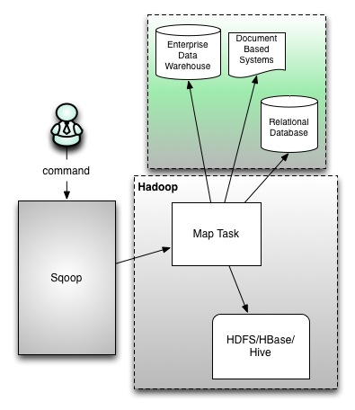
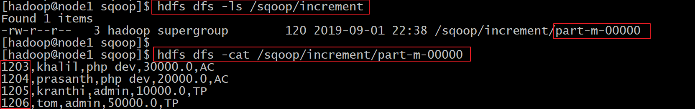

# Sqoop数据迁移工具


## 一、课前准备

1. 安装好对应版本的mysql
2. 安装好对应版本的hadoop集群
3. 安装好对应版本的hive


## 二、课堂主题

本堂课主要围绕sqoop的知识点进行讲解。主要包括以下几个方面

1. sqoop的核心概念
2. sqoop的架构原理
3. sqoop的导入
4. sqoop的导出


## 三、课堂目标

1. 掌握sqoop的数据导入
2. 掌握sqoop的数据导出


## 四、知识要点

### 1. Sqoop是什么（5分钟）

* Sqoop是apache旗下的一款 ”==Hadoop和关系数据库之间传输数据==”的工具
  * ==导入数据==
    * 将MySQL，Oracle导入数据到Hadoop的HDFS、HIVE、HBASE等数据存储系统
  * ==导出数据==
    * 从Hadoop的文件系统中导出数据到关系数据库


### 2. Sqoop的工作机制

* 将导入和导出的命令翻译成mapreduce程序实现
  * 在翻译出的mapreduce中主要是对inputformat和outputformat进行定制


### 3. Sqoop基本架构（10分钟）

* sqoop在发展中的过程中演进出来了两种不同的架构.[架构演变史](<https://blogs.apache.org/sqoop/entry/apache_sqoop_highlights_of_sqoop#comment-1561314193000>)

* ==sqoop1的架构图==



~~~
版本号为1.4.x为sqoop1 
在架构上：sqoop1使用sqoop客户端直接提交的方式 
访问方式：CLI控制台方式进行访问 
安全性：命令或脚本中指定用户数据库名及密码
~~~


* ==sqoop2的架构图==


~~~
版本号为1.99x为sqoop2 
在架构上：sqoop2引入了sqoop server，对connector实现了集中的管理 
访问方式：REST API、 JAVA API、 WEB UI以及CLI控制台方式进行访问 
~~~


### 4. Sqoop安装部署（5分钟）

==Sqoop安装很简单，解压好进行简单的修改就可以使用==

- 1、下载安装包

  - http://mirror.bit.edu.cn/apache/sqoop/1.4.7/sqoop-1.4.7.bin__hadoop-2.6.0.tar.gz
  - sqoop-1.4.7.bin__hadoop-2.6.0.tar.gz

- 2、规划安装目录

  - /opt/bigdata

- 3、上传安装包到服务器

- 4、解压安装包到指定的规划目录

  - tar -zxvf sqoop-1.4.7.bin__hadoop-2.6.0.tar.gz -C /opt/bigdata

- 5、重命名解压目录

  - mv sqoop-1.4.7.bin__hadoop-2.6.0  sqoop

- 6、修改配置

  - 进入到sqoop安装目录下的conf文件夹中

    - 先重命名文件

      - ==mv sqoop-env-template.sh  sqoop-env.sh==

    - 修改文件，添加java环境变量

      - ==vim sqoop-env.sh==

      ```shell
      #Set path to where bin/hadoop is available
      export HADOOP_COMMON_HOME=/opt/bigdata/hadoop
      
      #Set path to where hadoop-*-core.jar is available
      export HADOOP_MAPRED_HOME=/opt/bigdata/hadoop
      
      #set the path to where bin/hbase is available
      export HBASE_HOME=/opt/bigdata/hbase
      
      #Set the path to where bin/hive is available
      export HIVE_HOME=/opt/bigdata/hive
      ```


- 7、添加mysql驱动jar包

  * 把mysql的驱动jar包添加到sqoop的lib目录下，可以拷贝之前hive的lib目录下的mysql驱动

  ~~~shell
  cp /opt/bigdata/hive/lib/mysql-connector-java-5.1.38.jar /opt/bigdata/sqoop/lib/
  ~~~


- 8、配置sqoop环境变量

  - vim  /etc/profile

  ```
  export SQOOP_HOME=/opt/bigdata/sqoop
  export PATH=$PATH:$SQOOP_HOME/bin
  ```


- 9、让sqoop环境变量生效
  - source /etc/profile


### 5. Sqooq数据的导入（45分钟）

* 导入单个表从RDBMS到HDFS。表中的每一行被视为HDFS的记录。所有记录都存储为文本文件的文本数据（或者Avro、sequence文件等二进制数据） 

#### 5.1 列举出所有的数据库

* 命令行查看帮助文档

~~~
sqoop list-databases --help
~~~

* 列出node1上mysql数据库中所有的数据库名称

~~~shell
sqoop list-databases --connect jdbc:mysql://node1:3306/ --username root --password 123456
~~~

* 查看某一个数据库下面的所有数据表

~~~shell
sqoop list-tables --connect jdbc:mysql://node1:3306/userdb --username root --password 123456
~~~


#### 5.2 导入数据库表数据到HDFS

* 在MySQL数据库服务器中创建一个数据库userdb, 然后在创建一张表 emp，添加点测试数据到表中

* 从MySQL数据库服务器中的userdb数据库下的emp表导入HDFS上

~~~shell
sqoop import --connect jdbc:mysql://node1:3306/userdb --username root   --password 123456 --table emp --m 1
~~~

* 提交之后，会运行一个MR程序，最后查看HDFS上的目录看是否有数据生成


#### 5.3 导入数据库表数据到HDFS指定目录

* 在导入表数据到HDFS使用Sqoop导入工具，我们可以指定目标目录。
* 使用参数 ==--target-dir==来指定导出目的地，
* 使用参数==--delete-target-dir==来判断导出目录是否存在，如果存在就删掉

~~~shell
sqoop import  --connect jdbc:mysql://node1:3306/userdb --username root --password 123456  --table emp  --target-dir /sqoop/emp  --delete-target-dir --m 1
~~~

* 提交查看HDFS上的目录看是否有数据生成


#### 5.4 导入数据库表数据到HDFS指定目录并且指定数据字段的分隔符

* 这里使用参数 
  * ==--fields-terminated-by 分隔符==

~~~shell
sqoop import  --connect jdbc:mysql://node1:3306/userdb --username root --password 123456 --delete-target-dir --table emp  --target-dir /sqoop/emp1 --fields-terminated-by '#' --m 1
~~~

* 提交查看HDFS上的目录看是否有数据生成


#### 5.5 导入关系表到Hive中

* (1) 将我们mysql表当中的数据直接导入到hive表中的话，需要将hive的一个叫做==hive-exec-1.2.2.jar==包拷贝到sqoop的lib目录下

~~~shell
cp /opt/bigdata/hive/lib/hive-exec-1.2.2.jar /opt/bigdata/sqoop/lib/
~~~

* (2) 准备hive数据库与表

  * 在hive中创建一个数据库和表

  ~~~sql
  create database sqooptohive;
  
  create external table sqooptohive.emp_hive(id int,name string,deg string,salary double ,dept string) row format delimited fields terminated by '\001';
  ~~~

* (3) 把mysql表数据导入到hive表中

~~~shell
sqoop import --connect jdbc:mysql://node1:3306/userdb --username root --password 123456 --table emp --fields-terminated-by '\001' --hive-import --hive-table sqooptohive.emp_hive --hive-overwrite  --m 1
~~~

* (4) 执行完成了查看hive中表的数据


#### 5.6 导入数据库表数据到hive中(并自动创建hive表)

* 可以通过命令来将我们的mysql的表直接导入到hive表当中去，==不需要事先创建hive表==

~~~shell
sqoop import --connect jdbc:mysql://node1:3306/userdb --username root --password 123456 --hive-database sqooptohive --hive-table emp1 --table emp --hive-import -m 1 ;
~~~

*  执行完成了查看hive中表的数据


#### 5.7 导入表数据子集

* 我们可以导入表的使用Sqoop导入工具，"where"子句的一个子集。它执行在各自的数据库服务器相应的SQL查询，并将结果存储在HDFS的目标目录。
* 按照条件进行查找，通过==**--where**==参数来查找表emp当中==**dept**==字段的值为 **==TP==** 的所有数据导入到hdfs上面去

~~~shell
sqoop import \
--connect jdbc:mysql://node1:3306/userdb \
--username root --password 123456 --table emp \
--target-dir /sqoop/emp_where -m 1  --delete-target-dir \
--where "dept = 'TP'"
~~~

* 提交查看HDFS上的目录看是否有数据生成

  


#### 5.8 sql语句查找导入hdfs

* 我们还可以通过 –query参数来指定我们的sql语句，通过sql语句来过滤我们的数据进行导入

~~~shell
sqoop import \
--connect jdbc:mysql://node1:3306/userdb \
--username root --password 123456 \
--target-dir /sqoop/emp_sql -m 1  --delete-target-dir \
--query 'select * from emp where salary >30000 and $CONDITIONS' 
~~~

* 提交查看HDFS上的目录看是否有数据生成


* ==补充：==

  ~~~
  $CONTITONS是linux系统的变量，如果你想通过并行的方式导入结果，每个map task需要执行sql查询语句的副本，结果会根据sqoop推测的边界条件分区。query必须包含$CONDITIONS。这样每个scoop程序都会被替换为一个独立的条件。同时你必须指定--split-by '字段'，后期是按照字段进行数据划分，最后可以达到多个MapTask并行运行。
  ~~~


#### 5.9 增量导入

* 在实际工作当中，数据的导入很多时候都是==只需要导入增量数据即可==，并不需要将表中的数据全部导入到hive或者hdfs当中去，肯定会出现重复的数据的状况，所以我们一般都是选用一些字段进行增量的导入，为了支持增量的导入，sqoop也给我们考虑到了这种情况并且支持增量的导入数据

* 增量导入是仅导入新添加的表中的行的技术。

* 它需要添加 ==‘incremental’, ‘check-column’, 和 ‘last-value’==选项来执行增量导入。

  ~~~
  --incremental <mode>
  --check-column <column name>
  --last value <last check column value>
  ~~~

* ==第一种增量导入实现==

  * ==基于递增列的增量数据导入（Append方式）==
  * 导入emp表当中id大于1202的所有数据
    * 注意：==这里不能加上 --delete-target-dir  参数，添加就报错==

  ~~~shell
  sqoop import \
  --connect jdbc:mysql://node1:3306/userdb \
  --username root \
  --password 123456 \
  --table emp \
  --incremental append \
  --check-column id \
  --last-value 1202  \
  -m 1 \
  --target-dir /sqoop/increment1 
  ~~~

  * 提交查看HDFS上的目录看是否有数据生成




* ==第二种增量导入实现==

  * ==基于时间列的增量数据导入（LastModified方式）==

    * 此方式要求原有表中有time字段，它能指定一个时间戳
      * user表结构和数据

    

  ~~~shell
  sqoop import \
  --connect jdbc:mysql://node1:3306/userdb \
  --username root \
  --password 123456  \
  --table user \
  --target-dir /sqoop/incement2 \
  --incremental lastmodified  \
  --check-column createTime  \
  --last-value '2019-09-01 10:16:00'  \
  --m 1
  ~~~

  * 提交查看HDFS上的目录看是否有数据生成


### 6. Sqoop数据的导出（5分钟）

* 将数据从HDFS把文件导出到RDBMS数据库
  * 导出前，目标表必须存在于目标数据库中。
    * 默认操作是从将文件中的数据使用INSERT语句插入到表中
    * 更新模式下，是生成UPDATE语句更新表数据


#### 6.1 hdfs文件导出到mysql表中

* 1、数据是在HDFS当中的如下目录/user/hive/warehouse/hive_source，数据内容如下

~~~
1 zhangsan 20 hubei
2 lisi 30 hunan
3 wangwu 40 beijing
4 xiaoming 50 shanghai
~~~

* 2、创建一张mysql表
  * 注意mysql中的这个表一定要先创建！ 不然报错！

~~~sql
CREATE TABLE  fromhdfs (
   id INT DEFAULT NULL,
   name VARCHAR(100) DEFAULT NULL,
   age int DEFAULT NULL,
   address VARCHAR(100) DEFAULT NULL
) ENGINE=INNODB DEFAULT CHARSET=utf8;
~~~

* 3、执行导出命令

~~~shell
sqoop export \
--connect jdbc:mysql://node1:3306/userdb \
--username root --password 123456 \
--table fromhdfs \
--input-fields-terminated-by " " \
--export-dir /user/hive/warehouse/hive_source 

~~~

* 4、验证mysql表数据


## 五、拓展点、未来计划、行业趋势 

### 7. Sqoop作业

* 将事先定义好的数据导入导出任务按照指定流程运行

* 语法

~~~
sqoop job (generic-args) (job-args)
   [-- [subtool-name] (subtool-args)]
~~~

#### 7.1 创建作业

* ==--create==
  * 创建一个名为myjob,实现从mysql表数据导入到hdfs上的作业
    * 注意
      * 在创建job时，==命令"-- import" 中间有个空格==

~~~shell
sqoop job \
--create myjob \
-- import \
--connect jdbc:mysql://node1:3306/userdb \
--username root \
--password 123456 \
--table emp \
--target-dir /sqoop/myjob \
--delete-target-dir \
--m 1
~~~

#### 7.2 验证作业

* ==--list==

* 验证作业是否创建成功

  * 执行如下命令

  ~~~shell
  sqoop job --list
  
  
  最后显示：
  Available jobs:
    myjob
  ~~~


#### 7.3 查看作业

* ==--show==
* 查看作业的详细信息
  * 执行如下命令

~~~shell
sqoop job --show myjob
~~~


#### 7.4 执行作业

* ==--exec==

  * 用于执行保存的作业

  ~~~shell
  sqoop job --exec myjob
  ~~~

  * 解决sqoop需要输入密码的问题
    * 修改配置文件
      * vi /opt/bigdata/sqoop/conf/sqoop-site.xml

  ~~~xml
  <property>
      <name>sqoop.metastore.client.record.password</name>
      <value>true</value>
      <description>If true, allow saved passwords in the metastore.
      </description>
  </property>
  ~~~


#### 7.5 删除作业

- ==--delete==
  - 用于删除保存作业

```shell
sqoop job --delete myjob
```


## 六、总结


## 七、作业


## 八、互动问答


## 九、题库 - 本堂课知识点

